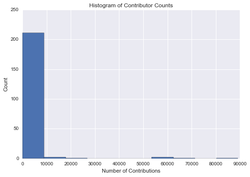

## [Wrangle OpenStreetMapData Report](P3 Wrangle OpenStreetMap Data Report.pdf)   


```python
# Lesson 6 - Iterative Parsing Code
#!/usr/bin/env python
# -*- coding: utf-8 -*- 
"""
Your task is to use the iterative parsing to process the map file and
find out not only what tags are there, but also how many, to get the
feeling on how much of which data you can expect to have in the map.
Fill out the count_tags function. It should return a dictionary with the 
tag name as the key and number of times this tag can be encountered in 
the map as value.

Note that your code will be tested with a different data file than the 'example.osm'
"""
import xml.etree.cElementTree as ET
import pprint
from collections import defaultdict

def count_tags(filename):
        """
        Reads in an XML file and determines the count for each XML tag within the document.
        
        Args:
            filename: The name of the XML file to iterate through
            
        Returns:
            counter: A dictionary with the tag names as keys and the counts as values.
        """
        counter = defaultdict(int)
        
        for line in ET.iterparse(filename):
            
            current_tag = line[1].tag
            
            counter[current_tag] += 1
            
        return counter
```


```python
# Lesson 6 - Tag Types code
#!/usr/bin/env python
# -*- coding: utf-8 -*-
import xml.etree.cElementTree as ET
import pprint
import re
"""
Your task is to explore the data a bit more.
Before you process the data and add it into MongoDB, you should check the "k"
value for each "<tag>" and see if they can be valid keys in MongoDB, as well as
see if there are any other potential problems.

We have provided you with 3 regular expressions to check for certain patterns
in the tags. As we saw in the quiz earlier, we would like to change the data
model and expand the "addr:street" type of keys to a dictionary like this:
{"address": {"street": "Some value"}}
So, we have to see if we have such tags, and if we have any tags with
problematic characters.

Please complete the function 'key_type', such that we have a count of each of
four tag categories in a dictionary:
  "lower", for tags that contain only lowercase letters and are valid,
  "lower_colon", for otherwise valid tags with a colon in their names,
  "problemchars", for tags with problematic characters, and
  "other", for other tags that do not fall into the other three categories.
See the 'process_map' and 'test' functions for examples of the expected format.
"""

lower = re.compile(r'^([a-z]|_)*$')

lower_colon = re.compile(r'^([a-z]|_)*:([a-z]|_)*$')

problemchars = re.compile(r'[=\+/&<>;\'"\?%#$@\,\. \t\r\n]')

def key_type(element, keys):
    """
    Determines whether a tag's attribute matches a regular expression and counts how many tags fall within each category.
    
    Args:
        element: An element from iterating over the XML file
        keys: A dictionary containing the classification names and counts as values.
    
    Returns: 
        keys: A dictionary of classification names and counts.
    """
    if element.tag == "tag":
        
        k = element.attrib['k']
        
        if lower.search(k) != None:
            
            keys['lower'] += 1
            
        elif lower_colon.search(k) != None:
            
            keys['lower_colon'] += 1
            
        elif problemchars.search(k) != None:
            
            keys['problemchars'] += 1
            
        else:
            keys['other'] += 1
            
    return keys

def process_map_keys(filename):
    """
    Iterates through an XML file and creates a dictionary of keys and their counts.
    
    Args:
        filename: An XML file.
    
    Returns: 
        keys: A dictionary of classification names and counts as values.
    """
    keys = {"lower": 0, "lower_colon": 0, "problemchars": 0, "other": 0}
    
    for _, element in ET.iterparse(filename):
        
        keys = key_type(element, keys)

    return keys
```


```python
# Lesson 6 - Exploring Users code
#!/usr/bin/env python
# -*- coding: utf-8 -*-
import xml.etree.cElementTree as ET
import pprint
import re
"""
Your task is to explore the data a bit more.
The first task is a fun one - find out how many unique users
have contributed to the map in this particular area!

The function process_map should return a set of unique user IDs ("uid")
"""

def get_user(element):
    """
    Returns the current tag's "uid" attribute.
    
    Args: 
        element: An XML element.
    
    Returns: 
        The 'uid' attribute for that element.
    """
    return element.attrib['uid']

def get_username(element):
    """
    Returns the current tag's "user" attribute.
    
    Args:
        element: An XML element.
    
    Returns:
        The 'user' attribute for that element.
    """
    return element.attrib['user']

def process_map_users(filename):
    """
    Iterates through an XML file and creates a set of unique user ids and usernames.
    
    Args:
        filename: An XML file.
    
    Returns:
        users: A set of unique user ids.
        usernames: A set of unique user names.
    """
    users = set()
    
    usernames = set()
    
    tags_with_uids = ['node', 'way', 'relation']
    
    for _, element in ET.iterparse(filename):
        
        if element.tag in tags_with_uids:
            
            usernames.add(get_username(element))
            users.add(get_user(element))

    return users, usernames
```


```python
# Lesson 6 - Improving Street Names code
"""
Your task in this exercise has two steps:

- audit the OSMFILE and change the variable 'mapping' to reflect the changes needed to fix 
    the unexpected street types to the appropriate ones in the expected list.
    You have to add mappings only for the actual problems you find in this OSMFILE,
    not a generalized solution, since that may and will depend on the particular area you are auditing.
- write the update_name function, to actually fix the street name.
    The function takes a string with street name as an argument and should return the fixed name
    We have provided a simple test so that you see what exactly is expected
"""
import xml.etree.cElementTree as ET
from collections import defaultdict
import re
import pprint

OSMFILE = "example4.osm"

# Matches the very last word in the street name
street_type_re = re.compile(r'\b\S+\.?$', re.IGNORECASE)

expected = ["Street", "Avenue", "Boulevard", "Drive", "Court", "Place", "Square", "Lane", "Road", 
            "Trail", "Parkway", "Commons"]

mapping = { "St": "Street",
            "St.": "Street",
            "Ave": "Avenue",
            "Rd.": "Road"            
            }


def audit_street_type(street_types, street_name):
    """
    Checks to see if the last word in the street name is in the expected list.  If it is not, then it adds this to a list for
    later review.
    
    Args:
        street_types: A set of street types
        street_name: A street name taken from the "addr:street" attribute.
    
    Returns:
        None
    
    """
    m = street_type_re.search(street_name)
    
    if m:
        
        street_type = m.group()
        
        if street_type not in expected:
            
            street_types[street_type].add(street_name)


def is_street_name(elem):
    """
    Checks to see whether or not the current tag's attribute is a street address
    
    Args:
        elem: An XML element.
    
    Returns:
        (boolean): True if the element is a street address, False otherwise.
    """
    return (elem.attrib['k'] == "addr:street")

def is_city_name(elem):
    """
    Checks to see whether or not the current tag's attribute is a city
    
    Args:
        elem: An XML element.
    
    Returns:
        (boolean): True if the element is a city, False otherwise.
    """
    return (elem.attrib['k'] == "addr:city")

def is_postcode(elem):
    """
    Checks to see whether or not the current tag's attribute is a postal code
    
    Args:
        elem: An XML element.
    
    Returns:
        (boolean): True if the element is a postal code, False otherwise.
    """
    #if elem.attrib['k'] == "addr:postcode":
    #    print "found postal code" + elem.attrib['v']
    #else:
    #    print "not postal code " + elem.attrib['v']
    return (elem.attrib['k'] == "addr:postcode")

# Exploring Postal Codes, City Names, and Latitude/Longitude
# 28.3323 <= LAT <= 28.4323
# -81.6152 <= LON <= -81.5048

def audit_lat_long(elem):
    """
    Determines if coordinates within a tag fall outside of the expected coordinate bounds
    
    Args:
        elem: An XML element. 
    """
    coords = {}
    lat = float(elem.attrib['lat'])
    lon = float(elem.attrib['lon'])
    
    if lat <= 28.3323 or lat >= 28.4323 or lon <= -81.6152 or lon >= -81.5048:
        lats.append(lat)
        lons.append(lon)
        #print "out of bounds", lat, lon
    #print lats
    return None

def audit(osmfile):
    """
    Opens an XML file and looks for tags that are street names.  For tags that are streets, it checks the street types
    by calling the audit_street_type function.
    
    Args:
        osmfile: An XML file.
    
    Returns:
        street_types: A set of street types.
    
    """
    osm_file = open(osmfile, "r")
    
    street_types = defaultdict(set)
    
    out_of_bounds = []
    
    for event, elem in ET.iterparse(osm_file, events=("start", "end")):
        
        if elem.tag == "node" or elem.tag == "way":
            
            if "lat" in elem.attrib.keys():
                
                    audit_lat_long(elem)
            
            for tag in elem.iter("tag"):
                
                
                if is_street_name(tag):
                    
                    audit_street_type(street_types, tag.attrib['v'])
                
                elif is_city_name(tag):
                    
                    cities.add(tag.attrib['v'])
                
                elif is_postcode(tag):
                
                    postcodes.add(tag.attrib['v'])
                           
    osm_file.close()
    
    return street_types

def update_name(name, mapping):
    """
    Updates a street type name based on the mapping.
    
    Args:
        name: The street name.
        mapping: A dictionary with incorrect street types as keys and the correct street types as values.
    
    Returns:
        (string): The updated street name based on the mapping.
    
    """
    recombine = []

    for split_name in name.split(' '):
        
        if split_name in mapping.keys():
            
            split_name = mapping[split_name]
            
        recombine.append(split_name)
        
    return " ".join(recombine)

# Check to see the unique city names and post codes in the OSM file
lats = []
lons = []
cities = set()
postcodes = set()
audit('walt-disney-world_florida.osm')
print cities
print postcodes
```

    set(['Windermere', 'Orlando', 'Lake Buena Vista,', 'Bay Lake', 'Kissimmee', 'Celebration', 'Davenport', 'Lake Buena Vista'])
    set(['32821', '32836', '32830-8446', '34786', '32830-8514', '34769', '32830-8424', '32830-8421', '33896', '32830-8400', 'FL 34747', '34741', '32830-8433', '32830-8411', '32832', '32830', '34747', '34746'])
    


```python
# Code used to determine the maximum and minimum coordinates within the data set
print max(lats)
print min(lats)
print max(lons)
print min(lons)
```

    28.4419994
    28.2430014
    -81.5070083
    -81.64
    


```python
# Lesson 6 - Preparing for Database

#!/usr/bin/env python
# -*- coding: utf-8 -*-
import xml.etree.cElementTree as ET
import pprint
import re
import codecs
import json
"""
Your task is to wrangle the data and transform the shape of the data
into the model we mentioned earlier. The output should be a list of dictionaries
that look like this:

{
"id": "2406124091",
"type: "node",
"visible":"true",
"created": {
          "version":"2",
          "changeset":"17206049",
          "timestamp":"2013-08-03T16:43:42Z",
          "user":"linuxUser16",
          "uid":"1219059"
        },
"pos": [41.9757030, -87.6921867],
"address": {
          "housenumber": "5157",
          "postcode": "60625",
          "street": "North Lincoln Ave"
        },
"amenity": "restaurant",
"cuisine": "mexican",
"name": "La Cabana De Don Luis",
"phone": "1 (773)-271-5176"
}

You have to complete the function 'shape_element'.
We have provided a function that will parse the map file, and call the function with the element
as an argument. You should return a dictionary, containing the shaped data for that element.
We have also provided a way to save the data in a file, so that you could use
mongoimport later on to import the shaped data into MongoDB. 

Note that in this exercise we do not use the 'update street name' procedures
you worked on in the previous exercise. If you are using this code in your final
project, you are strongly encouraged to use the code from previous exercise to 
update the street names before you save them to JSON. 

In particular the following things should be done:
- you should process only 2 types of top level tags: "node" and "way"
- all attributes of "node" and "way" should be turned into regular key/value pairs, except:
    * attributes in the CREATED array should be added under a key "created"
    * attributes for latitude and longitude should be added to a "pos" array,
      for use in geospacial indexing. Make sure the values inside "pos" array are floats
      and not strings. 
- if the second level tag "k" value contains problematic characters, it should be ignored
- if the second level tag "k" value starts with "addr:", it should be added to a dictionary "address"
- if the second level tag "k" value does not start with "addr:", but contains ":", you can
  process it in a way that you feel is best. For example, you might split it into a two-level
  dictionary like with "addr:", or otherwise convert the ":" to create a valid key.
- if there is a second ":" that separates the type/direction of a street,
  the tag should be ignored, for example:

<tag k="addr:housenumber" v="5158"/>
<tag k="addr:street" v="North Lincoln Avenue"/>
<tag k="addr:street:name" v="Lincoln"/>
<tag k="addr:street:prefix" v="North"/>
<tag k="addr:street:type" v="Avenue"/>
<tag k="amenity" v="pharmacy"/>

  should be turned into:

{...
"address": {
    "housenumber": 5158,
    "street": "North Lincoln Avenue"
}
"amenity": "pharmacy",
...
}

- for "way" specifically:

  <nd ref="305896090"/>
  <nd ref="1719825889"/>

should be turned into
"node_refs": ["305896090", "1719825889"]
"""
lower = re.compile(r'^([a-z]|_)*$')

lower_colon = re.compile(r'^([a-z]|_)*:([a-z]|_)*$')

problemchars = re.compile(r'[=\+/&<>;\'"\?%#$@\,\. \t\r\n]')

CREATED = [ "version", "changeset", "timestamp", "user", "uid"]

def is_address(elem):
    """
    Determines whether or not an element is an address.
    
    Args:
        elem: An XML element.
    
    Returns:
        True if the element attribute starts with 'addr:'
    
    """
    if elem.attrib['k'][:5] == "addr:":
        
        return True
    
def shape_element(element):
    """
    Transforms the XML data into the format specified above as a list of dictionaries.
    
    Args:
        element: An XML element.
    
    Returns:
        node: A dictionary in the correct format for the element.
    """
    node = {}
    
    if element.tag == "node" or element.tag == "way":
        
        address_info = {}
        
        nd_info = []
        
        node["type"] = element.tag
        
        node["id"] = element.attrib["id"]
        
        if "visible" in element.attrib.keys():
            
            node["visible"] = element.attrib["visible"]
            
        if "lat" in element.attrib.keys():
            
            node["pos"] = [float(element.attrib['lat']), float(element.attrib['lon'])]
            
        node["created"] = {"version": element.attrib['version'],
                            "changeset": element.attrib['changeset'],
                            "timestamp": element.attrib['timestamp'],
                            "uid": element.attrib['uid'],
                            "user": element.attrib['user']}
        
        for tag in element.iter("tag"):
            
            p = problemchars.search(tag.attrib['k'])
            
            if p:
                
                continue
                
            elif is_address(tag):
                
                if ":" in tag.attrib['k'][5:]:
                    
                    continue
                    
                else:
                    
                    if tag.attrib['k'][5:] == 'street':
                        
                        better_name = update_name(name, mapping)
                        
                        address_info[tag.attrib['k'][5:]] = better_name
                    
                    elif tag.attrib['k'][5:] == 'city':
                        
                        address_info[tag.attrib['k'][5:]] = tag.attrib['v'].strip(', ')
                    
                    elif tag.attrib['k'][5:] == 'postcode':
                        
                        m = re.search('(\d{5})([- ])?(\d{4})?', tag.attrib['v'])
                        
                        if m.group(3) == None:
                            
                            address_info[tag.attrib['k'][5:]] = m.group(1)
                            
                        else:
                            
                            address_info[tag.attrib['k'][5:]] = m.group(1) + '-' + m.group(3)
                        
                    else:
                        
                        address_info[tag.attrib['k'][5:]] = tag.attrib['v']
                    
            else:
                
                node[tag.attrib['k']] = tag.attrib['v']
                
        if address_info != {}:
            
            node['address'] = address_info
            
        for tag2 in element.iter("nd"):
            
            nd_info.append(tag2.attrib['ref'])
            
        if nd_info != []:
            
            node['node_refs'] = nd_info
            
        return node
    
    else:
        return None
    
def process_map(file_in, pretty = False):
    """
    Parses an XML file and transforms each element into the correct dictionary format.  Writes the transformed elements into
    a list which is then written to a JSON file.
    
    Args:
        file_in: The XML file to process.
        pretty: Default false.  Determines how the JSON is output into the file.
    
    Returns:
        data: A list of dictionaries of the transformed data.
    
    """
    file_out = "{0}.json".format(file_in)
    
    data = []
    
    with codecs.open(file_out, "w") as fo:
        
        for _, element in ET.iterparse(file_in):
            
            el = shape_element(element)
            
            if el:
                
                data.append(el)
                
                if pretty:
                    
                    fo.write(json.dumps(el, indent=2)+"\n")
                    
                else:
                    
                    fo.write(json.dumps(el) + "\n")
                    
    return data
```


```python
# Identify and count the number of tags in the Walt Disney World OpenStreeMap Data File
tags = count_tags('walt-disney-world_florida.osm')
pprint.pprint(tags)
```

    defaultdict(<type 'int'>, {'node': 345665, 'nd': 421210, 'bounds': 1, 'member': 5864, 'tag': 121848, 'relation': 587, 'way': 28048, 'osm': 1})
    


```python
# Look through the OSM file to identify any issues with tag names
keys = process_map_keys('walt-disney-world_florida.osm')
pprint.pprint(keys)
```

    {'lower': 111070, 'lower_colon': 9007, 'other': 1768, 'problemchars': 3}
    


```python
# Create sets of the unique users and usernames in the Walt Disney World OpenStreeMap Data File
# Can use these to compare with the cleaned file to see any differences
users, usernames = process_map_users('walt-disney-world_florida.osm')
```


```python
# Modify the expected street types list to include Circle, Way, and Highway
expected = ["Street", "Avenue", "Boulevard", "Drive", "Court", "Place", "Square", "Lane", "Road", 
            "Trail", "Parkway", "Commons", "Circle", "Way", "Highway"] 

# Modify the street type mappings to account for Blvd, Ct, and Ln
mapping = { "St": "Street",
            "St.": "Street",
            "Ave": "Avenue",
            "Rd.": "Road",
            "Blvd": "Boulevard",
            "Ct": "Court",
            "Ln": "Lane"
            }

# This code was run to gain insight into the street types that were present in the original OSM file
st_types = audit('walt-disney-world_florida.osm')
pprint.pprint(dict(st_types))

for st_type, ways in st_types.iteritems():
        for name in ways:
            better_name = update_name(name, mapping)
            print name, "=>", better_name
```

    {'5730': set(['5730']),
     'Blvd': set(['Archfeld Blvd', 'Formosa Gardens Blvd']),
     'Ct': set(['Cardinal Ct']),
     'Encinas': set(['Via Encinas']),
     'Ln': set(['Laura Ln']),
     'South': set(['International Drive South']),
     'Stars': set(['Avenue of the Stars'])}
    Laura Ln => Laura Lane
    Via Encinas => Via Encinas
    5730 => 5730
    Avenue of the Stars => Avenue of the Stars
    Formosa Gardens Blvd => Formosa Gardens Boulevard
    Archfeld Blvd => Archfeld Boulevard
    International Drive South => International Drive South
    Cardinal Ct => Cardinal Court
    


```python
# Clean the data and store it in JSON
data = process_map('walt-disney-world_florida.osm', True)
```


```python
def get_db():
    """
    Creates a connection to a MongoDB that contains the imported clean data
    
    Args: None
    
    Returns: The wdw collection from the openstreet database
    
    """
    from pymongo import MongoClient
    
    client = MongoClient('localhost:27017')
    
    db = client.openstreet.wdw
    
    return db

# The JSON file was imported into MongoDB via the command line.  This will store the db for use with Python.
db = get_db()
```


```python
db.find_one()

#result = db.distinct({'created.user'})
len(db.distinct('created.user'))
```


    218


```python
# Query the database for a list all entries that are restaurants
results = db.aggregate([{'$match': {'amenity': 'restaurant'}}])
print len(list(results))

# Query the database to find the count of the different types of amenities and then display the top 10 results
result  = db.aggregate([{"$group":{"_id":"$amenity", "count":{"$sum":1}}}, {"$sort":{"count": -1}}])
pprint.pprint(list(result)[:10])
```

    144
    [{u'_id': None, u'count': 372145},
     {u'_id': u'parking', u'count': 398},
     {u'_id': u'fast_food', u'count': 162},
     {u'_id': u'toilets', u'count': 159},
     {u'_id': u'restaurant', u'count': 144},
     {u'_id': u'fountain', u'count': 113},
     {u'_id': u'drinking_water', u'count': 87},
     {u'_id': u'atm', u'count': 64},
     {u'_id': u'swimming_pool', u'count': 45},
     {u'_id': u'bar', u'count': 36}]
    


```python
import pandas as pd
import matplotlib.pyplot as plt
%matplotlib inline
import seaborn as sns

def descriptive_statistics(dataFrame, column):
    """
    Description
    
    Args:
    
    Returns:
    
    """
    print column + " Summary Statistics"
    print "Mean:",dataFrame[column].mean()
    print "Median:",dataFrame[column].median()
    print "Variance:",dataFrame[column].var()
    print "Standard Deviation:",dataFrame[column].std()
    print "Max:",dataFrame[column].max()
    print "Min:",dataFrame[column].min()
    print "Lower Quartile:",dataFrame[column].quantile(0.25)
    print "Upper Quartile:",dataFrame[column].quantile(0.75)
    print "Sum:",dataFrame[column].sum()
    print
# Top Contributor
#result  = db.aggregate([{"$group":{"_id":"$created.user", "count":{"$sum":1}}}, {"$sort":{"count": -1}}, {"$limit":1}])
result  = db.aggregate([{"$group":{"_id":"$created.user", "count":{"$sum":1}}}, {"$sort":{"count": -1}}, {"$limit":25}])
pprint.pprint(list(result))
contributor_counts = []
result  = db.aggregate([{"$group":{"_id":"$created.user", "count":{"$sum":1}}}, {"$sort":{"count": -1}}])
for element in result:
    contributor_counts.append(int(element['count']))
contributor_counts_df = pd.DataFrame(contributor_counts, columns = ['Number of Contributions'])
#print contributor_counts_df
descriptive_statistics(contributor_counts_df, 'Number of Contributions')
plt.hist(contributor_counts_df['Number of Contributions'])
plt.title("Histogram of Contributor Counts")
plt.xlabel("Number of Contributions")
plt.ylabel("Count")
#plt.axis([0, 100, 0, 225])
plt.show()
```

    [{u'_id': u'Brian@Brea', u'count': 89169},
     {u'_id': u'3yoda', u'count': 65289},
     {u'_id': u'Adam Martin', u'count': 58517},
     {u'_id': u'NE2', u'count': 54129},
     {u'_id': u'epcotfan', u'count': 22524},
     {u'_id': u'KindredCoda', u'count': 15239},
     {u'_id': u'Gulopine', u'count': 13047},
     {u'_id': u'Silvermane', u'count': 8761},
     {u'_id': u'RobChafer', u'count': 6163},
     {u'_id': u'SteveDorries', u'count': 4784},
     {u'_id': u'California Bear', u'count': 3875},
     {u'_id': u'Omnific', u'count': 3029},
     {u'_id': u'maxolasersquad', u'count': 2438},
     {u'_id': u'wvdp', u'count': 2260},
     {u'_id': u'thetornado76', u'count': 1865},
     {u'_id': u'ZeroOne', u'count': 1786},
     {u'_id': u'grouper', u'count': 1717},
     {u'_id': u'woodpeck_fixbot', u'count': 1593},
     {u'_id': u'Seandebasti', u'count': 1511},
     {u'_id': u'Trex2001', u'count': 1338},
     {u'_id': u'crystalwalrein', u'count': 1304},
     {u'_id': u'ryanfork', u'count': 1099},
     {u'_id': u'ediyes', u'count': 985},
     {u'_id': u'TrendyMagic', u'count': 936},
     {u'_id': u'maxerickson', u'count': 832}]
    Number of Contributions Summary Statistics
    Mean: 1714.27981651
    Median: 8.0
    Variance: 87715728.7647
    Standard Deviation: 9365.66755574
    Max: 89169
    Min: 1
    Lower Quartile: 2.0
    Upper Quartile: 92.0
    Sum: 373713
    
    





```python
db.find().count()
```


    373713


```python
db.find({'type':'node'}).count()
```


    345481


```python
db.find({'type':'way'}).count()
```


    28033


```python
# Create a table of the % contribution for the top ten contributors
print contributor_counts_df['Number of Contributions'][0:10] / contributor_counts_df['Number of Contributions'].sum() * 100
print

# Calculate the % contribution overall for the top ten contributors
print float(contributor_counts_df['Number of Contributions'][0:10].sum()) / \
                                        contributor_counts_df['Number of Contributions'].sum() * 100
```

    0    23.860289
    1    17.470358
    2    15.658273
    3    14.484109
    4     6.027085
    5     4.077728
    6     3.491182
    7     2.344312
    8     1.649126
    9     1.280127
    Name: Number of Contributions, dtype: float64
    
    90.3425890991
    


```python
#!/usr/bin/env python
# -*- coding: utf-8 -*-
"""
Code for creating a sample.osm of my data file taken from
https://www.udacity.com/course/viewer#!/c-nd002/l-3168208620/m-3189488621
"""
import xml.etree.ElementTree as ET  # Use cElementTree or lxml if too slow

OSM_FILE = "walt-disney-world_florida.osm"  # Replace this with your osm file
SAMPLE_FILE = "sample.osm"


def get_element(osm_file, tags=('node', 'way', 'relation')):
    """Yield element if it is the right type of tag
    
    Reference:
    http://stackoverflow.com/questions/3095434/inserting-newlines-in-xml-file-generated-via-xml-etree-elementtree-in-python
    """
    context = ET.iterparse(osm_file, events=('start', 'end'))
    
    _, root = next(context)
    
    for event, elem in context:
        
        if event == 'end' and elem.tag in tags:
            
            yield elem
            
            root.clear()

#postals = set()
with open(SAMPLE_FILE, 'wb') as output:
    
    output.write('<?xml version="1.0" encoding="UTF-8"?>\n')
    
    output.write('<osm>\n  ')

    # Write every 10th top level element
    for i, element in enumerate(get_element(OSM_FILE)):
        
        if i % 10 == 0:
            
            output.write(ET.tostring(element, encoding='utf-8'))

    output.write('</osm>')

```


```python
result  = db.aggregate([{"$group":{"_id":"$address.postcode", "count":{"$sum":1}}}, {"$sort":{"count": -1}}])
pprint.pprint(list(result))
```

    [{u'_id': None, u'count': 373529},
     {u'_id': u'34747', u'count': 44},
     {u'_id': u'34786', u'count': 42},
     {u'_id': u'32830', u'count': 32},
     {u'_id': u'32836', u'count': 25},
     {u'_id': u'34746', u'count': 20},
     {u'_id': u'33896', u'count': 8},
     {u'_id': u'32821', u'count': 3},
     {u'_id': u'34741', u'count': 1},
     {u'_id': u'34769', u'count': 1},
     {u'_id': u'32830-8411', u'count': 1},
     {u'_id': u'32832', u'count': 1},
     {u'_id': u'32830-8424', u'count': 1},
     {u'_id': u'32830-8514', u'count': 1},
     {u'_id': u'32830-8421', u'count': 1},
     {u'_id': u'32830-8433', u'count': 1},
     {u'_id': u'32830-8400', u'count': 1},
     {u'_id': u'32830-8446', u'count': 1}]
    


```python
result  = db.aggregate([{"$group":{"_id":"$address.city", "count":{"$sum":1}}}, {"$sort":{"count": -1}}])
pprint.pprint(list(result))
```

    [{u'_id': None, u'count': 373352},
     {u'_id': u'Orlando', u'count': 168},
     {u'_id': u'Kissimmee', u'count': 103},
     {u'_id': u'Windermere', u'count': 42},
     {u'_id': u'Lake Buena Vista', u'count': 34},
     {u'_id': u'Davenport', u'count': 8},
     {u'_id': u'Celebration', u'count': 4},
     {u'_id': u'Bay Lake', u'count': 2}]
    
